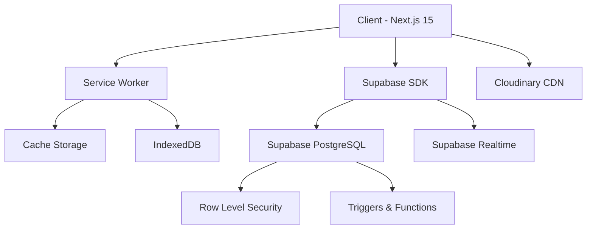

# 🍽️ RT Restaurant Management System

> **Professional Restaurant Management System with Offline-First Architecture**

A complete, production-ready restaurant management solution built with **Next.js 15**, **Supabase**, and **PWA** capabilities. Features dual interfaces (Admin & Staff), real-time updates, offline support, and comprehensive inventory management.

[](https://nextjs.org/)
[](https://www.typescriptlang.org/)
[](https://supabase.com/)
[](https://web.dev/progressive-web-apps/)
[](LICENSE)

---

## 📋 Table of Contents

- [Features](#-features)
- [Architecture](#-architecture)
- [Tech Stack](#-tech-stack)
- [Prerequisites](#-prerequisites)
- [Installation](#-installation)
- [Database Setup](#-database-setup)
- [Environment Variables](#-environment-variables)
- [Running the Application](#-running-the-application)
- [Project Structure](#-project-structure)
- [User Roles](#-user-roles)
- [Key Features Deep Dive](#-key-features-deep-dive)
- [Offline Support](#-offline-support)
- [API Documentation](#-api-documentation)
- [Deployment](#-deployment)
- [Troubleshooting](#-troubleshooting)
- [Contributing](#-contributing)
- [License](#-license)

---

## 🚀 Features

### 🔐 **Admin Dashboard**
- **Complete Analytics**: Real-time revenue, orders, staff performance
- **Menu Management**: Categories, items, pricing with image uploads (Cloudinary)
- **Staff Management**: Employee profiles, attendance tracking, performance metrics
- **Table Management**: Table status, capacity, sections
- **Inventory Control**: Stock levels, reorder alerts, supplier management
- **History & Reports**: Comprehensive analytics with CSV export
- **Data Cleanup**: Automated old data archival with important order preservation
- **Profile Management**: Admin profile with bio, avatar, password reset

### 👨‍💼 **Staff Interface (POS)**
- **Menu Ordering**: Category-based menu with search and filters
- **Cart System**: Real-time cart with item quantity management
- **Order Management**:
    - Dine-in orders with table assignment
    - Delivery orders with customer details
    - Order status tracking (Pending/Completed/Cancelled)
- **Table Status**: Real-time table availability and current bills
- **Attendance**: Clock-in/Clock-out with auto-tracking
- **Receipt Generation**: Professional PDF receipts with print support
- **Split Bill**: Split orders by items or amount

### 🌐 **Offline-First Architecture**
- **Service Worker**: Advanced caching with v3 strategy
- **IndexedDB**: Local data persistence for 7-30 days
- **Sync Engine**: Auto-sync when connection restores
- **Offline Indicator**: Real-time connection status
- **Image Caching**: Progressive image loading with placeholders

### 🎨 **UI/UX Excellence**
- **Dark/Light Mode**: System-aware theme with manual toggle
- **Responsive Design**: Mobile-first, tablet, desktop optimized
- **Touch-Optimized**: 44px+ touch targets, swipe gestures
- **Command Palette**: Keyboard shortcuts (Cmd/Ctrl+K)
- **Universal Components**: Reusable, theme-aware UI library
- **Loading States**: Skeleton screens, spinners, progress bars
- **Error Boundaries**: Graceful error handling with recovery

---

## 🏗️ Architecture



### **Data Flow**
1. **Client Request** → Service Worker checks cache
2. **Cache Miss** → Fetch from Supabase
3. **Response** → Cache + IndexedDB + UI Update
4. **Offline** → Serve from cache/IndexedDB
5. **Online Restored** → Sync queued changes

---

## 🛠️ Tech Stack

### **Frontend**
- **Framework**: Next.js 15 (App Router)
- **Language**: TypeScript 5.0
- **Styling**: TailwindCSS 3.4
- **UI Components**:
    - Lucide React (Icons)
    - Custom Universal Components
    - Radix UI Primitives
- **State Management**:
    - Zustand (Cart Store)
    - React Context (Theme, Auth)
- **Forms**: React Hook Form + Zod validation

### **Backend & Database**
- **BaaS**: Supabase (PostgreSQL 15)
- **ORM**: Supabase JS Client
- **Realtime**: Supabase Realtime Subscriptions
- **File Storage**: Cloudinary (Images)

### **PWA & Offline**
- **Service Worker**: Custom SW with v3 caching
- **Local Storage**: IndexedDB (via Dexie.js)
- **Manifest**: Dynamic manifest.json (Admin/Public)
- **Push Notifications**: Ready (future implementation)

### **Development**
- **Package Manager**: npm/yarn/pnpm
- **Linting**: ESLint + Prettier
- **Type Checking**: TypeScript strict mode
- **Git Hooks**: Husky (optional)

---

## 📦 Prerequisites

Before you begin, ensure you have:

- **Node.js**: v18.0.0 or higher
- **npm/yarn/pnpm**: Latest version
- **Supabase Account**: [Free tier available](https://supabase.com/)
- **Cloudinary Account**: [Free tier available](https://cloudinary.com/)
- **Git**: For version control

---

## 🔧 Installation

### **1. Clone the Repository**

```bash
git clone https://github.com/yourusername/rt-.git
cd rt-restaurant
```

### **2. Install Dependencies**

```bash
pmpm install
# or
npm install
# or
yarn install
# or
pnpm install
```

### **3. Environment Setup**

Create `.env.local` file in root:

```env
# Supabase Configuration
NEXT_PUBLIC_SUPABASE_URL=https://your-project.supabase.co
NEXT_PUBLIC_SUPABASE_ANON_KEY=your-anon-key-here

# Cloudinary Configuration
NEXT_PUBLIC_CLOUDINARY_CLOUD_NAME=your-cloud-name
CLOUDINARY_API_KEY=your-api-key
CLOUDINARY_API_SECRET=your-api-secret

# Site Configuration
NEXT_PUBLIC_SITE_URL=http://localhost:3000

```

---

## 🗄️ Database Setup

### **Step 1: Create Supabase Project**

1. Go to [Supabase Dashboard](https://app.supabase.com/)
2. Click "New Project"
3. Note your **Project URL** and **Anon Key**

### **Step 2: Run SQL Schema**

1. Open **SQL Editor** in Supabase Dashboard
2. Copy entire schema from `database-schema.sql` (artifact above)
3. Click "Run" to execute

### **Step 3: Verify Tables**

Run this query to verify:

```sql
SELECT table_name 
FROM information_schema.tables 
WHERE table_schema = 'public' 
ORDER BY table_name;
```

**Expected Tables:**
- `admin_config`
- `menu_categories`
- `menu_items`
- `restaurant_tables`
- `waiters`
- `orders`
- `order_items`
- `waiter_shifts`
- `inventory_categories`
- `inventory_items`
- `daily_summaries`

### **Step 4: Enable Realtime (Optional)**

```sql
ALTER PUBLICATION supabase_realtime ADD TABLE orders;
ALTER PUBLICATION supabase_realtime ADD TABLE restaurant_tables;
ALTER PUBLICATION supabase_realtime ADD TABLE waiters;
```

---

## ⚙️ Environment Variables

### **Required Variables**

| Variable | Description | Example |
|----------|-------------|---------|
| `NEXT_PUBLIC_SUPABASE_URL` | Supabase project URL | `https://abc.supabase.co` |
| `NEXT_PUBLIC_SUPABASE_ANON_KEY` | Supabase anonymous key | `eyJhbGc...` |
| `NEXT_PUBLIC_CLOUDINARY_CLOUD_NAME` | Cloudinary cloud name | `your-cloud` |
| `CLOUDINARY_API_KEY` | Cloudinary API key | `123456789` |
| `CLOUDINARY_API_SECRET` | Cloudinary API secret | `abc123...` |
| `NEXT_PUBLIC_SITE_URL` | Production URL | `https://yourdomain.com` |

### **Optional Variables**

| Variable | Description | Default |
|----------|-------------|---------|
| `ADMIN_PASSWORD_SALT` | Bcrypt salt rounds | `10` |
| `OFFLINE_CACHE_DAYS` | Days to keep offline data | `7` |

---

## 🏃 Running the Application

### **Development Mode**

```bash
npm run dev
# or
yarn dev
# or
pnpm dev
```

**Access URLs:**
- **Staff Interface**: http://localhost:3000
- **Admin Dashboard**: http://localhost:3000/admin

### **Production Build**

```bash
npm run build
npm start
```

### **Type Checking**

```bash
npm run type-check
```

### **Linting**

```bash
npm run lint
```

---

## 📁 Project Structure

```
rt-restaurant/
├── src/
│   ├── app/
│   │   ├── (public)/                # Staff interface routes
│   │   │   ├── page.tsx             # Menu/POS
│   │   │   ├── orders/              # Orders management
│   │   │   ├── tables/              # Table status
│   │   │   └── attendance/          # Staff attendance
│   │   ├── admin/                   # Admin dashboard routes
│   │   │   ├── (auth)/
│   │   │   │   └── login/           # Admin login
│   │   │   ├── (pages)/
│   │   │   │   ├── menu/            # Menu management
│   │   │   │   ├── waiters/         # Staff management
│   │   │   │   ├── tables/          # Table setup
│   │   │   │   ├── inventory/       # Inventory control
│   │   │   │   ├── history/         # Reports & analytics
│   │   │   │   ├── attendance/      # Attendance records
│   │   │   │   └── settings/        # Admin settings
│   │   │   └── page.tsx             # Admin dashboard
│   │   ├── api/                     # API routes
│   │   │   ├── auth/                # Authentication
│   │   │   ├── admin/               # Admin operations
│   │   │   ├── upload/              # File uploads
│   │   │   └── jobs/                # Background jobs
│   │   ├── layout.tsx               # Root layout
│   │   └── globals.css              # Global styles
│   ├── components/
│   │   ├── ui/                      # Universal UI components
│   │   │   ├── UniversalDataTable.tsx
│   │   │   ├── UniversalModal.tsx
│   │   │   ├── ResponsiveInput.tsx
│   │   │   ├── ResponsiveStatsGrid.tsx
│   │   │   ├── CloudinaryUpload.tsx
│   │   │   └── Toast.tsx
│   │   ├── layout/                  # Layout components
│   │   │   ├── AutoSidebar.tsx
│   │   │   └── PageHeader.tsx
│   │   ├── cart/                    # Cart components
│   │   ├── features/                # Feature components
│   │   │   ├── receipt/
│   │   │   └── split-bill/
│   │   ├── admin/                   # Admin components
│   │   └── ErrorBoundary.tsx
│   ├── lib/
│   │   ├── supabase/                # Supabase clients
│   │   │   ├── client.ts
│   │   │   └── server.ts
│   │   ├── hooks/                   # Custom React hooks
│   │   │   ├── useSupabase.ts
│   │   │   ├── useOrders.ts
│   │   │   ├── useInventory.ts
│   │   │   └── useAdminAuth.ts
│   │   ├── store/                   # State management
│   │   │   └── cart-store.ts
│   │   ├── db/                      # Offline database
│   │   │   ├── offlineManager.ts
│   │   │   └── syncEngine.ts
│   │   └── utils/                   # Utilities
│   │       ├── validation.ts
│   │       ├── statusHelpers.ts
│   │       └── dbOptimizer.ts
│   └── types/                       # TypeScript types
│       └── index.ts
├── public/
│   ├── icons/                       # PWA icons
│   ├── manifest-admin.json          # Admin manifest
│   ├── manifest-public.json         # Staff manifest
│   ├── sw.js                        # Service worker
│   └── offline.html                 # Offline fallback
├── database-schema.sql              # Complete DB schema
├── .env.local.example               # Environment template
├── next.config.js                   # Next.js config
├── tailwind.config.ts               # Tailwind config
├── tsconfig.json                    # TypeScript config
└── README.md                        # This file
```

---

## 👥 User Roles

### **1. Admin**
- **Default Password**: `admin123` (⚠️ **CHANGE IMMEDIATELY**)
- **Access**: `/admin` routes only
- **Capabilities**:
    - Full CRUD on menu, staff, tables, inventory
    - View all orders and analytics
    - Data cleanup and archival
    - Profile and password management

### **2. Staff (Waiters)**
- **Access**: Public routes (`/`, `/orders`, `/tables`, `/attendance`)
- **Capabilities**:
    - Create and manage orders
    - Track table status
    - Clock in/out for shifts
    - Print receipts
    - Split bills
    - No admin access

---

## 🔍 Key Features Deep Dive

### **1. Offline-First Architecture**

#### **Service Worker Strategy (v3)**

```javascript
// public/sw.js
const CACHE_STRATEGIES = {
  admin: 'Cache First',      // Admin pages load instantly
  api: 'Network First',      // Fresh data preferred
  images: 'Cache First',     // Images cached indefinitely
  static: 'Cache First'      // JS/CSS cached
}
```

#### **IndexedDB Schema**

```typescript
// Stores: menu, tables, orders, waiters, inventory
// Auto-sync every 30 seconds when online
// TTL: 7-30 days based on data type
```

#### **Sync Conflicts**
- **Resolution**: Last-write-wins
- **Queued Changes**: Stored and retried on reconnect
- **User Notification**: Toast messages for sync status

### **2. Real-Time Updates**

```typescript
// Auto-subscribes to table changes
supabase
  .channel('orders')
  .on('postgres_changes', {
    event: '*',
    schema: 'public',
    table: 'orders'
  }, payload => {
    // Update local state
  })
  .subscribe()
```

### **3. Cart System**

```typescript
// Zustand store with persistence
interface CartStore {
  items: CartItem[]
  addItem: (item: MenuItem) => void
  removeItem: (id: string) => void
  updateQuantity: (id: string, qty: number) => void
  getTotal: () => number
  clear: () => void
}
```

### **4. Receipt Generation**

- **Format**: Professional PDF via browser print
- **Includes**:
    - Restaurant header
    - Order items with quantities
    - Subtotal, tax, total
    - Payment method
    - Timestamp and order ID
- **Actions**: Print, Download, Email (future)

### **5. Inventory Tracking**

```typescript
// Stock status calculation
function getStockStatus(qty: number, reorder: number) {
  if (qty === 0) return 'critical'      // Red
  if (qty <= reorder) return 'low'      // Orange
  if (qty <= reorder * 2) return 'medium' // Blue
  return 'high'                          // Green
}
```

### **6. Data Cleanup**

```typescript
// Admin can archive orders older than X days
// Options:
- 1 month, 3 months, 6 months, 1 year
- Preserve important orders (> 10,000 PKR)
- Delete associated images from Cloudinary
```

---

## 📱 PWA Features

### **Installation**

- **Android**: "Add to Home Screen" prompt
- **iOS**: Share → "Add to Home Screen"
- **Desktop**: Install icon in address bar

### **Offline Capabilities**

✅ Full menu browsing  
✅ View cached orders  
✅ Check table status  
✅ View attendance records  
⚠️ Cannot create new orders (online required)  
⚠️ Cannot upload images (online required)

### **Manifest Files**

- **Admin**: `/manifest-admin.json` (dark theme, landscape)
- **Staff**: `/manifest-public.json` (light theme, portrait)

---

## 🔌 API Documentation

### **Authentication**

#### **POST** `/api/auth/verify-admin`
```json
{
  "password": "string"
}
```
**Response:** `{ success: boolean, profile: AdminProfile }`

#### **POST** `/api/auth/reset-password`
```json
{
  "currentPassword": "string",
  "newPassword": "string"
}
```

### **File Upload**

#### **POST** `/api/upload/cloudinary`
```typescript
FormData {
  file: File,
  folder: 'menu-items' | 'staff-profiles' | 'inventory-items'
}
```
**Response:** `{ url: string, public_id: string }`

#### **DELETE** `/api/upload/cloudinary`
```json
{
  "public_id": "string"
}
```

### **Data Cleanup**

#### **POST** `/api/admin/cleanup-data`
```json
{
  "timeRange": "1month" | "3months" | "6months" | "1year",
  "keepImportant": boolean
}
```
**Response:**
```json
{
  "success": true,
  "deleted": {
    "orders": 150,
    "images": 45,
    "sizeFreed": 23
  },
  "message": "✅ Cleaned 150 orders..."
}
```

---

## 🚀 Deployment

### **Vercel (Recommended)**

```bash
# Install Vercel CLI
npm i -g vercel

# Deploy
vercel

# Set environment variables
vercel env add NEXT_PUBLIC_SUPABASE_URL production
vercel env add NEXT_PUBLIC_SUPABASE_ANON_KEY production
# ... repeat for all variables

# Deploy to production
vercel --prod
```

### **Environment Variables**

Set all variables from `.env.local` in Vercel dashboard:
- Project Settings → Environment Variables
- Add each variable for Production, Preview, Development

### **Custom Domain**

1. Vercel Dashboard → Domains
2. Add your domain
3. Update DNS records as instructed

### **Post-Deployment**

1. Test PWA installation
2. Verify offline functionality
3. Check Service Worker registration
4. Test admin login
5. Create sample menu items

---

## 🐛 Troubleshooting

### **Common Issues**

#### **1. Service Worker Not Updating**

```javascript
// Clear all caches and reload
navigator.serviceWorker.getRegistrations()
  .then(registrations => {
    registrations.forEach(reg => reg.unregister())
  })
```

#### **2. Supabase Connection Failed**

- ✅ Check `.env.local` variables
- ✅ Verify Supabase project is active
- ✅ Check Supabase API quotas
- ✅ Ensure RLS policies allow access

#### **3. Cloudinary Upload Failing**

- ✅ Verify API credentials
- ✅ Check file size (< 5MB)
- ✅ Ensure upload preset exists
- ✅ Check CORS settings in Cloudinary

#### **4. Admin Login Not Working**

```sql
-- Reset admin password in Supabase SQL Editor
UPDATE admin_config 
SET password_hash = '$2a$10$vI8aWBnW3fID.ZQ4/zo1G.q1lRps.9cGLcZEiGDMVr5yUP1KUOYTa'
WHERE id = 1;
-- Password is now: admin123
```

#### **5. Offline Data Not Syncing**

```typescript
// Force sync in browser console
window.location.reload()

// Check IndexedDB
// DevTools → Application → IndexedDB → rt-restaurant
```

### **Debug Mode**

Enable debug logs:

```typescript
// In offlineManager.ts
const DEBUG = true

// Shows detailed sync logs
```

---

## 🤝 Contributing

We welcome contributions! Here's how:

1. **Fork** the repository
2. **Create** feature branch: `git checkout -b feature/amazing-feature`
3. **Commit** changes: `git commit -m 'Add amazing feature'`
4. **Push** to branch: `git push origin feature/amazing-feature`
5. **Open** Pull Request

### **Development Guidelines**

- ✅ Follow existing code style
- ✅ Add TypeScript types for new features
- ✅ Update README if adding major features
- ✅ Test offline functionality
- ✅ Ensure mobile responsiveness

---

## 📄 License

This project is licensed under the **MIT License** - see the [LICENSE](LICENSE) file for details.

---

## 🙏 Acknowledgments

- **Next.js Team** - Amazing React framework
- **Supabase** - Powerful BaaS platform
- **Cloudinary** - Reliable image CDN
- **Tailwind CSS** - Utility-first CSS framework
- **Lucide Icons** - Beautiful icon library

---

## 📞 Support

- **Issues**: [GitHub Issues](https://github.com/yourusername/rt-restaurant/issues)
- **Discussions**: [GitHub Discussions](https://github.com/yourusername/rt-restaurant/discussions)
- **Email**: support@rtrestaurant.com

---

## 🗺️ Roadmap

- [ ] Push notifications for new orders
- [ ] Mobile apps (React Native)
- [ ] Multi-branch support
- [ ] Customer-facing order tracking
- [ ] QR code menu ordering
- [ ] Analytics dashboard
- [ ] WhatsApp integration
- [ ] Loyalty program

---

**Built for ❤️ RT Restaurant**

⭐ **Star this repo** if you find it useful!# at-restaurant
